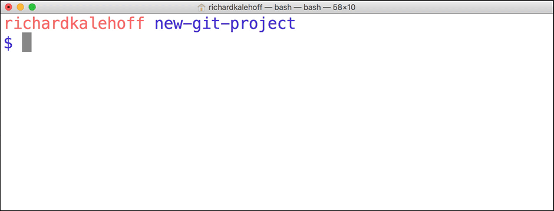
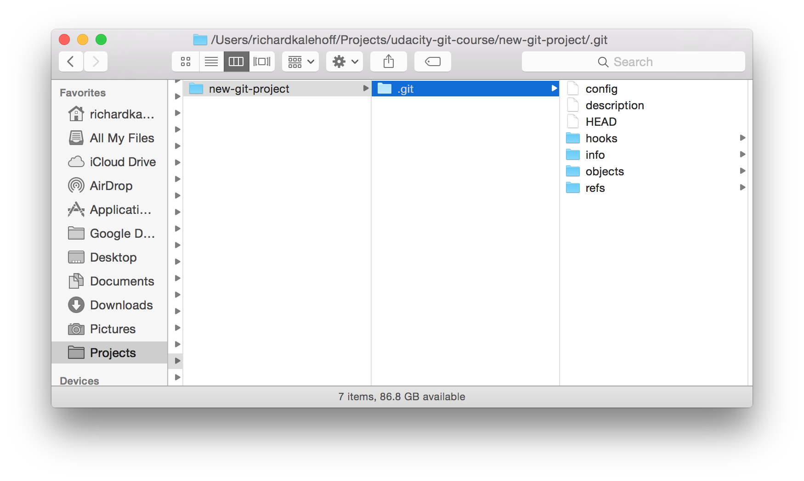

Before you can make commits or do anything else with a git repository, the repository needs to actually exist. To create a new repository with Git, we'll use the git init command.

The init subcommand is short for "initialize", which is helpful because it's the command that will do all of the initial setup of a repository. We'll look at what it does in just a second.
> # Required Commands
> Heads up! We'll be using the following terminal commands in this lesson:
> - ```ls``` - used to list files and directories
> - ```mkdir``` - used to create a new directory
> - ```cd``` - used to change directories
> - ```rm``` - used to remove files and directories
> - If you're not sure how to use them, check out our course on Linux Command Line Basics!
> We'll also be using the idea of the current working directory, the directory that your shell is "looking at" right now. Using cd changes your working directory, and using ```ls``` (by itself) lists the files in the working directory. If you lose track of what your shell's working directory is, you can print its name with the ```pwd``` command (which stands for "print working directory")

# Create Course Directories
We're about to create a new project for this course. Since we're all professionals, we want our projects organized. If you already have a location on your computer where you put all your projects, then keep doing what you're doing. I'll be storing all of my work in a directory called ```udacity-git-course.```

If you want to follow along with me:

- create a directory called  ```udacity-git-course```
- inside that, create another directory called ```new-git-project```
- use the ```cd``` command to move into the ```new-git-project``` directory

If you're a copy/paster like me, just run this command on the terminal - ```mkdir -p udacity-git-course/new-git-project && cd $_ ``` (Before running this command, make sure you cd to where you want these files stored. For example, if you want the files stored on your Desktop, then make sure you cd to the Desktop before running the command.)

If you're all set, then your terminal should be "inside" the ```new-git-project``` directory and look like this:


# Git Init
Fantastic work - we're all set up and ready to start using the ```git init``` command!

This is one of the easiest commands to run. All you have to do is run ```git init``` on the terminal. That's it! Go ahead, why not give it a try right now!



# Git Init's Effect
Running the ```git init``` command sets up all of the necessary files and directories that Git will use to keep track of everything. All of these files are stored in a directory called ```.git``` (notice the . at the beginning - that means it'll be a hidden directory on Mac/Linux). This ```.git``` directory is the "repo"! This is where git records all of the commits and keeps track of everything!

Let's take a brief look at the contents of the ```.git``` directory.

> WARNING: Don't directly edit any files inside the ```.git``` directory. This is the heart of the repository. If you change file names and/or file content, git will probably lose track of the files that you're keeping in the repo, and you could lose a lot of work! It's okay to look at those files though, but don't edit or delete them.



# .Git Directory Contents
We're about to take a look at the .git directory...it's not vital for this course, though, so don't worry about memorizing anything, it's here if you want to dig a little deeper into how Git works under the hood.

Here's a brief synopsis on each of the items in the .git directory:

- **config file** - where all project specific configuration settings are stored.
  From the Git Book:

  > Git looks for configuration values in the configuration file in the Git directory (.git/config) of whatever repository you’re currently using. These values are specific to that single repository.
  
  For example, let's say you set that the global configuration for Git uses your personal email address. If you want your work email to be used for a specific project rather than your personal email, that change would be added to this file.

- **description file** - this file is only used by the GitWeb program, so we can ignore it
- **hooks directory** - this is where we could place client-side or server-side scripts that we can use to hook   into Git's different lifecycle events
- **info directory** - contains the global excludes file
- **objects directory** - this directory will store all of the commits we make
- **refs directory** - this directory holds pointers to commits (basically the "branches" and "tags")

Remember, other than the "hooks" directory, you shouldn't mess with pretty much any of the content in here. The "hooks" directory can be used to hook into different parts or events of Git's workflow, but that's a more advanced topic that we won't be getting into in this course.

# Further Research
- [Git Internals - Plumbing and Porcelain](https://git-scm.com/book/en/v2/Git-Internals-Plumbing-and-Porcelain)
- [Customizing Git - Git Hooks](https://git-scm.com/book/en/v2/Customizing-Git-Git-Hooks)

# Git Init Recap
Use the ```git init``` command to create a new, empty repository in the current directory.
```
$ git init
```
Running this command creates a hidden ```.git``` directory. This ```.git``` directory is the brain/storage center for the repository. It holds all of the configuration files and directories and is where all of the commits are stored.