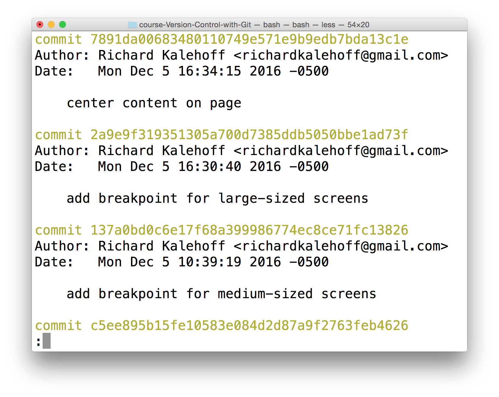

# The Git Log Command
Finding the answers to these questions is exactly what ```git log``` can do for us! Instead of explaining everything that it can do for us, let's experience it! Go ahead and run the ```git log``` command in the terminal:
```
$ git log
```
The terminal should display the following screen.


# Navigating The Log
If you're not used to a pager on the command line, navigating in ```Less``` can be a bit odd. Here are some helpful keys:

- to scroll down, press
  - j or ↓ to move down one line at a time
  - d to move by half the page screen
  - f to move by a whole page screen
- to scroll up, press
  - k or ↑ to move up one line at a time
  - u to move by half the page screen
  - b to move by a whole page screen
- press q to quit out of the log (returns to the regular command prompt)

Git records a ton of information when a commit is made. See if you can use git log to answer the following questions!

# Git Log Recap
Let's do a quick recap of the git log command. The git log command is used to display all of the commits of a repository.
```
$ git log
```
By default, this command displays:

- the SHA
- the author
- the date
- and the message
...of every commit in the repository. I stress the "By default" part of what Git displays because the git log command can display a lot more information than just this.
