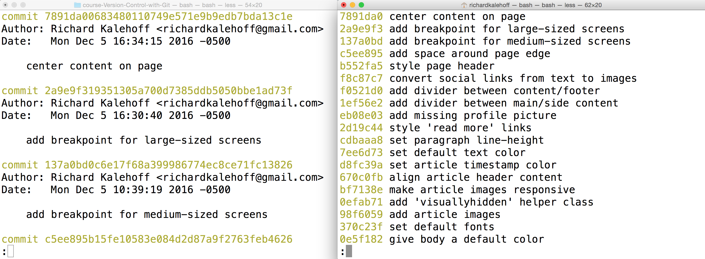

You made it all this way - congrats on getting this far! Seriously! Learning Git is a challenging undertaking. I applaud you on your perseverance.

Take a look at this output from running git log:


We've been looking closely at all the detailed information that ```git log``` displays. But now, take a step back and look at all of the information as a whole.

Let's think about some of these questions:

**the SHA** - ```git log``` will display the complete SHA for every single commit. Each SHA is unique, so we don't really need to see the entire SHA. We could get by perfectly fine with knowing just the first 6-8 characters. Wouldn't it be great if we could save some space and show just the first 5 or so characters of the SHA?
**the author** - the ```git log``` output displays the commit author for every single commit! It could be different for other repositories that have multiple people collaborating together, but for this one, there's only one person making all of the commits, so the commit author will be identical for all of them. Do we need to see the author for each one? What if we wanted to hide that information?
**the date** - By default, ```git log``` will display the date for each commit. But do we really care about the commit's date? Knowing the date might be important occasionally, but typically knowing the date isn't vitally important and can be ignored in a lot of cases. Is there a way we could hide that to save space?
**the commit message** - this is one of the most important parts of a commit message...we usually always want to see this
What could we do here to not waste a lot of space and make the output smaller? We can use a **flag**.

# git log --oneline
The git log command has a flag that can be used to alter how it displays the repository's information. That flag is ```--oneline```:
```
$ git log --oneline
```
Check out how different the output is!


