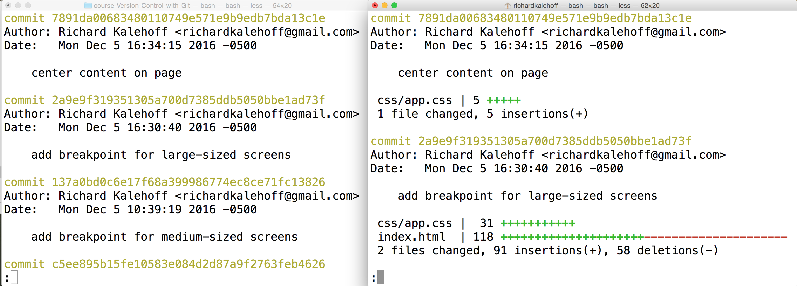
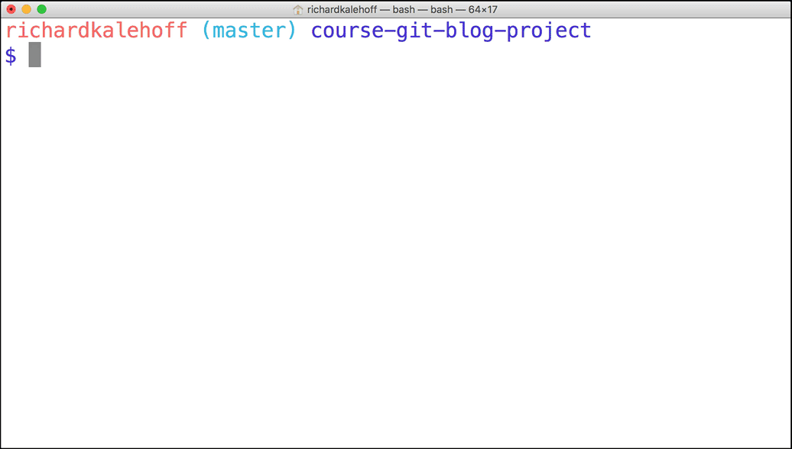
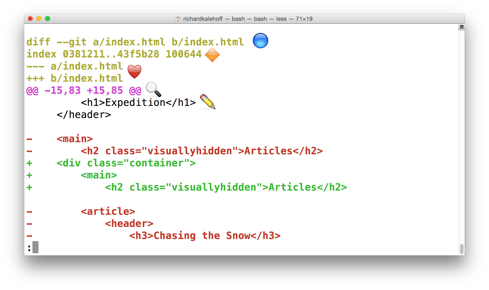

You made it all this way - congrats on getting this far! Seriously! Learning Git is a challenging undertaking. I applaud you on your perseverance.

Take a look at this output from running git log:


We've been looking closely at all the detailed information that ```git log``` displays. But now, take a step back and look at all of the information as a whole.

Let's think about some of these questions:

**the SHA** - ```git log``` will display the complete SHA for every single commit. Each SHA is unique, so we don't really need to see the entire SHA. We could get by perfectly fine with knowing just the first 6-8 characters. Wouldn't it be great if we could save some space and show just the first 5 or so characters of the SHA?
**the author** - the ```git log``` output displays the commit author for every single commit! It could be different for other repositories that have multiple people collaborating together, but for this one, there's only one person making all of the commits, so the commit author will be identical for all of them. Do we need to see the author for each one? What if we wanted to hide that information?
**the date** - By default, ```git log``` will display the date for each commit. But do we really care about the commit's date? Knowing the date might be important occasionally, but typically knowing the date isn't vitally important and can be ignored in a lot of cases. Is there a way we could hide that to save space?
**the commit message** - this is one of the most important parts of a commit message...we usually always want to see this
What could we do here to not waste a lot of space and make the output smaller? We can use a **flag**.

# git log --oneline
The git log command has a flag that can be used to alter how it displays the repository's information. That flag is ```--oneline```:
```
$ git log --oneline
```
Check out how different the output is!


We just looked at the --oneline flag to show one commit per line. That's great for getting an overview of the repository. But what if we want to dig in a little to see what file or files were changed by a commit?

# git log --stat Intro
The ```git log``` command has a flag that can be used to display the files that have been changed in the commit, as well as the number of lines that have been added or deleted. The flag is ```--stat``` ("stat" is short for "statistics"):

```
$ git log --stat
```
Run this command and check out what it displays.


This command:

- displays the file(s) that have been modified
- displays the number of lines that have been added/removed
- displays a summary line with the total number of modified files and lines that have been added/removed

# Viewing Changes
We know that ```git log``` will show us the commits in a repository, and if we add the ```--stat``` flag, we can see what files were modified and how many lines of code were added or removed. Wouldn't it be awesome if we could see exactly what those changes were?

If this isn't the best part of a version control system, I don't know what is! Being able to see the exact changes that were made to a file is incredibly important! Being able to say, "oh, ok, so this commit adds 5 pixels of border-radius to the button!".

For example, in the blog project, the commit ```a3dc99a``` has the message "center content on page" and modifies the CSS file by adding 5 lines. What are those five lines that were added? How can we figure out what those 5 lines are?


# git log -p
The ```git log``` command has a flag that can be used to display the actual changes made to a file. The flag is ```--patch``` which can be shortened to just ```-p```:
```
$ git log -p
```
Run this command and check out what it displays.


# Annotated git log -p Output

Using the image above, let's do a quick recap of the git log -p output:

- 🔵 - the file that is being displayed
- 🔶 - the hash of the first version of the file and the hash of the second version of the file
    - not usually important, so it's safe to ignore
- ❤️ - the old version and current version of the file
- 🔍 - the lines where the file is added and how many lines there are
    - -15,83 indicates that the old version (represented by the -) started at line 15 and that the file had 83 lines
    - +15,85 indicates that the current version (represented by the +) starts at line 15 and that there are now 85 lines...these 85 lines are shown in the patch below
- ✏️ - the actual changes made in the commit
    - lines that are red and start with a minus (-) were in the original version of the file but have been removed by the commit
    - lines that are green and start with a plus (+) are new lines that have been added in the commit

This command adds the following to the default output:

- displays the files that have been modified
- displays the location of the lines that have been added/removed
- displays the actual changes that have been made