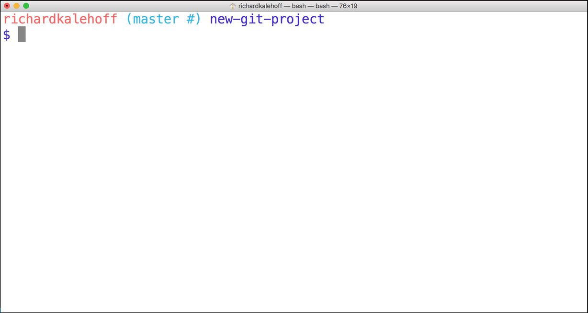

# Big Picture Review
That's really cool, isn't it! We haven't done anything specific with Git just yet, but it's watching this directory (since it's a Git project), and it knows that we've created a couple of new files. What's also pretty neat about the output of the ```git status``` command is that it's telling us that the files are untracked by Git.

Let's do a quick review of what's going on and what we're about to do:

we have some new files that we want Git to start tracking
for Git to track a file, it needs to be committed to the repository
for a file to be committed, it needs to be in the Staging Index
the ```git add``` command is used to move files from the Working Directory to the Staging Index
there are currently three, untracked files in the Working Directory
```index.html```
```app.css``` in the ```css``` directory
```app.js``` in the ```js``` directory
So the first step to getting any files committed to the repository is to add them from the Working Directory to the Staging Index. We will be using the ```git add``` command to move all three of these files to the Staging Index.


## Staging Files
Alrighty, it's go time! Run the following command on the Terminal which uses ```git add``` to add ```index.html``` to the Staging Index:
```
$ git add index.html
```
Note - we are only adding the ```index.html``` file. We'll add the CSS and JavaScript files in just a second.



Running the git add command produces no output (as long as there wasn't an error). So how do we have Git tell us what it did and has happened to the index.html file that was added? That's what git status does. You're probably sick of me stressing the importance of the git status command, but it's an extremely helpful command, especially if you're new to version control and/or the command line.

Let's check out the status of the project:
```
$ git status
```
This is the output I get:


## Changes To Be Committed
There's now a new section in the output of ```git status``` - the "Changes to be committed" area! This new "Changes to be committed" section displays files that are in the Staging Area! Right now it only displays the ```index.html``` file, so this file is the only item on the Staging Index. To continue this train of thought, if we made a commit right now, only the index.html file would be committed.
> TIP: Did you also notice the helpful text that's located just beneath "Changes to be committed"? It says ```(use "git rm --cached <file>..." to unstage)``` This is a hint of what you should do if you accidentally ran ```git add``` and gave it the wrong file.

> As a side note, ```git rm --cached``` is not like the shell's ```rm``` command. ```git rm --cached``` will not destroy any of your work; it just removes it from the Staging Index.

> Also, this used the word "unstage". The act of moving a file from the Working Directory to the Staging Index is called "staging". If a file has been moved, then it has been "staged". Moving a file from the Staging Index back to the Working Directory will unstage the file. If you read documentation that says "stage the following files" that means you should use the ```git add``` command.

## Stage Remaining Files
The index.html file has been staged. Let's stage the other two files. Now we could run the following:

$ git add css/app.css js/app.js
...but that's a lot of extra typing. We could use a special command line character to help:

The Period .
The period refers to the current directory and can be used as a shortcut to refer to all files and directories (including all nested files and directories!).

```
$ git add css/app.css js/app.js
# would become
$ git add .
```
The only thing to be careful of is that you might accidentally include more files than you meant to. Right now we want both css/app.css and js/app.js to be staged, so running this command is fine right now. But let's say you added some images to an img directory but didn't want to stage them just yet. Running git add . will stage them. If you do stage files that you didn't mean to, remember that git status will tell you the command to use to "unstage" files.

## Git Add Recap
The git add command is used to move files from the Working Directory to the Staging Index.
```
$ git add <file1> <file2> … <fileN>
```
This command:

- takes a space-separated list of file names
- alternatively, the period . can be used in place of a list of files to tell Git to add the current directory (and all nested files)
