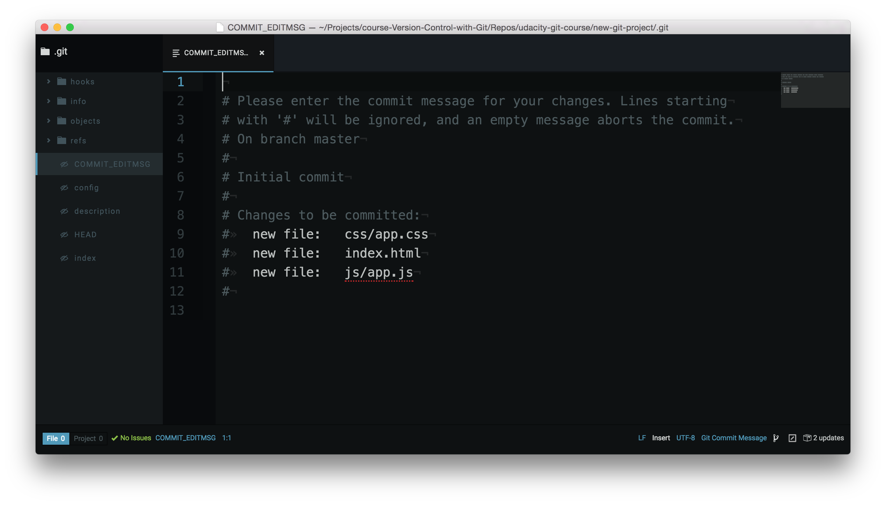

# Make A Commit
Ok, let's do it!

To make a commit in Git you use the ```git commit``` command, but don't run it just yet. Running this command will open the code editor that you configured way back in the first lesson. If you haven't run this command yet:
```
$ git config --global core.editor <your-editor's-config-went-here>
```
...go back to the Git configuration step and configure Git to use your chosen editor.

If you didn't do this step and you already ran ```git commit```, then Git probably defaulted to using the "Vim" editor. Vim is a popular editor for people who have been using Unix or Linux systems forever, but it's not the friendliest for new users. It's definitely not in the scope of this course. Check out this forum post on how to [get out of Vim ](https://discussions.udacity.com/t/escaping-from-vim-in-the-command-line/235917) and return to the regular command prompt.

If you did configure your editor, then go ahead and make a commit using the git commit command:
```
$ git commit
```
Remember, your editor should pop open and you should see something like this:


# Terminal Hangs
If you switch back to the Terminal for a quick second, you'll see that the Terminal is chillin' out just waiting for you to finish with the code editor that popped up. You don't need to worry about this, though. Once we add the necessary content to the code editor and finally close the code editor window, the Terminal will unfreeze and return to normal.


# Code Editor Commit Message Explanation
Ok, switch back to the code editor. Here's what's showing in my editor:
```
# Please enter the commit message for your changes. Lines starting
# with '#' will be ignored, and an empty message aborts the commit.
# On branch master
#
# Initial commit
#
# Changes to be committed:
#    new file:   css/app.css
#    new file:   index.html
#    new file:   js/app.js
#
```
The first paragraph is telling us exactly what we need to do - we need to supply a message for this commit. Also, any line that begins with the # character will be ignored. Farther down it says that this will be the initial commit. Lastly, it's giving us a list of the files that will be committed.

Since this is the very first commit of the repository, we'll use the commit message "Initial commit". The text "Initial commit" isn't special, but it's the de facto commit message for the very first commit. If you want to use something else, feel free!

Type out your commit message on the first line of the code editor:

# Finish Committing
Now save the file and close the editor window (closing just the pane/tab isn't enough, you need to close the code editor window that the git commit command opened).

Awesome, now switch back to the Terminal and you should see something like the following:


# First Commit, Congrats!
You just made your first commit - woohoo! 🙌🏼 How does it feel? Was it more towards the awe-inspiring side or the anticlimactic. Honestly, when I made my first commit, I was a bit like:

> "Wait...is that it? You just add the files you want to have committed to the Staging Area, and then you run 'git commit'?"
...and the answer to my questions are "Yes" and "Yes". That's all there is to it. At first, version control seems like this overwhelming obstacle that one must overcome to become a true programmer/developer/designer/etc. But once you get a handle on the terminology (which I think is the most challenging parts), then the actually using version control isn't all that challenging.

> Bypass The Editor With The -m Flag
> TIP: If the commit message you're writing is short and you don't want to wait for your code editor to open up to type it out, you can pass your message directly on the command line with the -m flag:
> ```
> $ git commit -m "Initial commit"
> ```
> In the example above, the text "Initial commit" is used as the commit message. Be aware that you can't provide a description for the commit, only the message part.

# What To Include In A Commit
I've been telling you what files to create, giving you the content to include, and telling you when you should make commits. But when you're on your own, how do you know what you should include in a commit and when/how often you should make commits?

**The goal is that each commit has a single focus**. Each commit should record a single-unit change. Now this can be a bit subjective (which is totally fine), but each commit should make a change to just one aspect of the project.

Now this isn't limiting the number of lines of code that are added/removed or the number of files that are added/removed/modified. Let's say you want to change your sidebar to add a new image. You'll probably:

- add a new image to the project files
- alter the HTML
- add/modify CSS to incorporate the new image
- A commit that records all of these changes would be totally fine!

Conversely, a commit shouldn't include unrelated changes - changes to the sidebar and rewording content in the footer. These two aren't related to each other and shouldn't be included in the same commit. Work on one change first, commit that, and then change the second one. That way, if it turns out that one change had a bug and you have to undo it, you don't have to undo the other change too.

The best way that I've found to think about what should be in a commit is to think, "What if all changes introduced in this commit were erased?". If a commit were erased, it should only remove one thing.
> Don't worry, commits don't get randomly erased.
> 
> In a later lesson, we'll look at using Git to undo changes made in commits and how to manually, carefully remove the last commit that was made.
#  Git Commit Recap
The git commit command takes files from the Staging Index and saves them in the repository.
```
$ git commit
```
This command:

- will open the code editor that is specified in your configuration
    - (check out the Git configuration step from the first lesson to configure your editor)

Inside the code editor:

- a commit message must be supplied
- lines that start with a # are comments and will not be recorded
- save the file after adding a commit message
- close the editor to make the commit

Then, use git log to review the commit you just made!