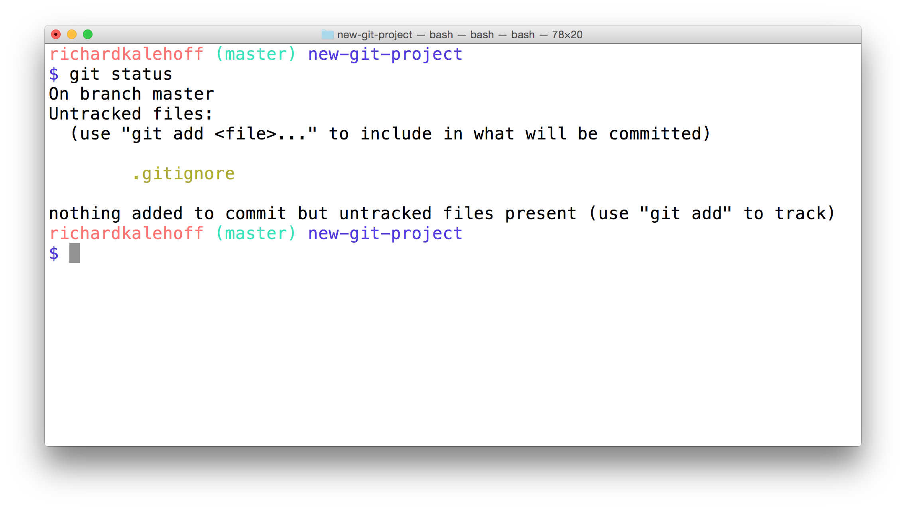

# Git Ignore
If you want to keep a file in your project's directory structure but make sure it isn't accidentally committed to the project, you can use the specially named file, .gitignore (note the dot at the front, it's important!). Add this file to your project in the same directory that the hidden ```.git``` directory is located. All you have to do is list the names of files that you want Git to ignore (not track) and it will ignore them.

Let's try it with the "project.docx" file. Add the following line inside the ```.gitignore``` file:

project.docx
Now run ```git status``` and check its output:


Git knows to look at the contents of a file with the name ```.gitignore```. Since it saw "project.docx" in it, it ignored that file and doesn't show it in the output of ```git status```.

# Globbing Crash Course
Let's say that you add 50 images to your project, but want Git to ignore all of them. Does this mean you have to list each and every filename in the ```.gitignore``` file? Oh gosh no, that would be crazy! Instead, you can use a concept called [globbing](https://en.wikipedia.org/wiki/Glob_(programming)).

Globbing lets you use special characters to match patterns/characters. In the ```.gitignore``` file, you can use the following:

- blank lines can be used for spacing
- ```#``` - marks line as a comment
- ```*``` - matches 0 or more characters
- ```?``` - matches 1 character
- ```[abc]``` - matches a, b, or c
- ```**``` - matches nested directories - ```a/**/z``` matches
    - a/z
    - a/b/z
    - a/b/c/z
So if all of the 50 images are JPEG images in the "samples" folder, we could add the following line to ```.gitignore``` to have Git ignore all 50 images.
```
samples/*.jpg
```