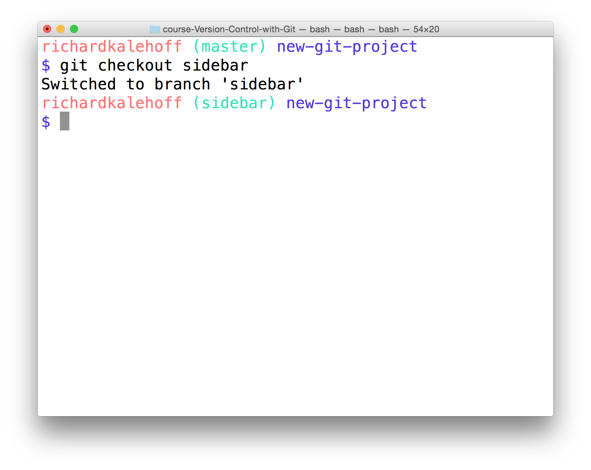
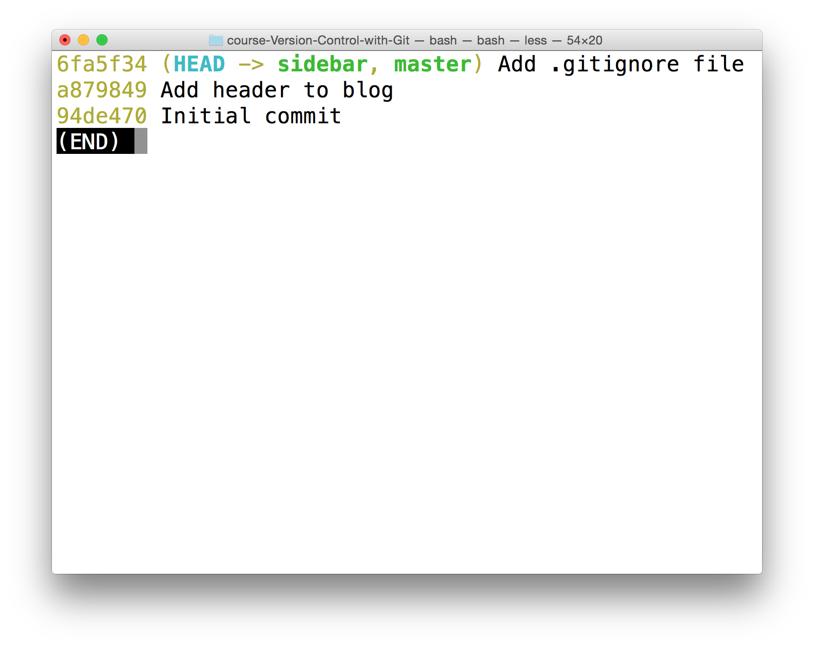

[](https://youtu.be/ywcOC6CLG4s=35s "git branch big picture")

# The git branch command
The git branch command is used to interact with Git's branches:
```
$ git branch
```
It can be used to:

- list all branch names in the repository
- create new branches
- delete branches

If we type out just git branch it will list out the branches in a repository:


# Create A Branch
To create a branch, all you have to do is use ```git branch``` and provide it the name of the branch you want it to create. So if you want a branch called "sidebar", you'd run this command:
```
$ git branch sidebar
```

# The ```git checkout``` Command
Remember that when a commit is made that it will be added to the current branch. So even though we created the new ```sidebar```, no new commits will be added to it since we haven't switched to it, yet. If we made a commit right now, that commit would be added to the ```master``` branch, not the ```sidebar``` branch. We've already seen this in the demo, but to switch between branches, we need to use Git's checkout command.
```
$ git checkout sidebar
```
It's important to understand how this command works. Running this command will:

- remove all files and directories from the Working Directory that Git is tracking
  - (files that Git tracks are stored in the repository, so nothing is lost)
- go into the repository and pull out all of the files and directories of the commit that the branch points to

So this will remove all of the files that are referenced by commits in the master branch. It will replace them with the files that are referenced by the commits in the sidebar branch. This is very important to understand, so go back and read these last two sentences.

The funny thing, though, is that both ```sidebar``` and ```master``` are pointing at the same commit, so it will look like nothing changes when you switch between them. But the command prompt will show "sidebar", now:


# Branches In The Log
The branch information in the command prompt is helpful, but the clearest way to see it is by looking at the output of ```git log```. But just like we had to use the ```--decorate``` flag to display Git tags, we need it to display branches.
```
$ git log --oneline --decorate
```
This is what my log output displays (yours might look different depending on what commits you've made):


In the output above, notice how the special "HEAD" indicator we saw earlier has an arrow pointing to the sidebar branch. It's pointing to sidebar because the sidebar branch is the current branch, and any commits made right now will be added to the sidebar branch.

# The Active Branch
```
git branch
```
The active branch will have an asterisk next to it

# Delete A Branch
A branch is used to do development or make a fix to the project that won't affect the project (since the changes are made on a branch). Once you make the change on the branch, you can combine that branch into the ```master``` branch (this "combining of branches" is called "merging" and we'll look at shortly).

Now after a branch's changes have been merged, you probably won't need the branch anymore. If you want to delete the branch, you'd use the ```-d``` flag. The command below includes the ```-d``` flag which tells Git to delete the provided branch (in this case, the "sidebar" branch).
```
$ git branch -d sidebar
```
One thing to note is that you can't delete a branch that you're currently on. So to delete the ```sidebar``` branch, you'd have to switch to either the ```master``` branch or create and switch to a new branch.

Deleting something can be quite nerve-wracking. Don't worry, though. Git won't let you delete a branch if it has commits on it that aren't on any other branch (meaning the commits are unique to the branch that's about to be deleted). If you created the ```sidebar``` branch, added commits to it, and then tried to delete it with the ```git branch -d sidebar```, Git wouldn't let you delete the branch because you can't delete a branch that you're currently on. If you switched to the ```master``` branch and tried to delete the ```sidebar``` branch, Git also wouldn't let you do that because those new commits on the sidebar branch would be lost! To force deletion, you need to use a capital ```D``` flag - ```git branch -D sidebar```.
