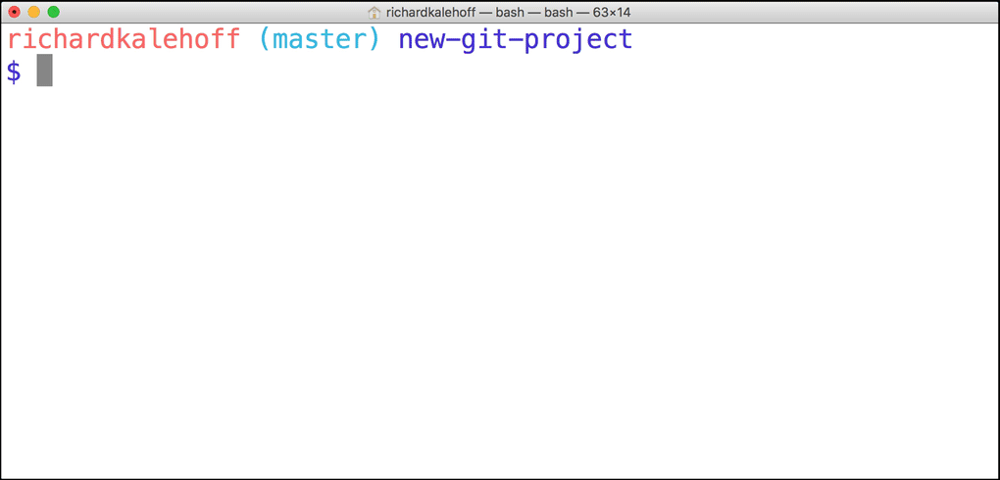

Remember that the purpose of a topic branch (like sidebar) is that it lets you make changes that do not affect the master branch. Once you make changes on the topic branch, you can either decide that you don't like the changes on the branch and you can just delete that branch, or you can decide that you want to keep the changes on the topic branch and combine those changes in with those on another branch.

Combining branches together is called **merging**.

Git can automatically merge the changes on different branches together. This branching and merging ability is what makes Git incredibly powerful! You can make small or extensive changes on branches, and then just use Git to combine those changes together.

Let's see how this works, in theory. Pay attention to the two main types of merges in Git, a regular **merge** and a **Fast-forward merge**.
[](https://youtu.be/gQiWicrreJg)

> ⚠️ Know The Branch ⚠️
> It's very important to know which branch you're on when you're about to merge branches together. Remember that making a merge makes a commit.

> As of right now, we do not know how to undo changes. We'll go over it in the next lesson, but if you make a merge on the wrong branch, use this command to undo the merge:

> ```git reset --hard HEAD^```

> (Make sure to include the ```^``` character! It's a known as a "Relative Commit Reference" and indicates "the parent commit". We'll look at Relative Commit References in the next lesson.)

# The Merge Command
The ```git merge``` command is used to combine Git branches:
```
$ git merge <name-of-branch-to-merge-in>
```
When a merge happens, Git will:

- look at the branches that it's going to merge
- look back along the branch's history to find a single commit that both branches have in their commit history
- combine the lines of code that were changed on the separate branches together
- makes a commit to record the merge

# Fast-forward Merge
In our project, I've checked out the ```master``` branch and I want it to have the changes that are on the ```footer``` branch. If I wanted to verbalize this, I could say this is - "I want to merge in the ```footer``` branch". That "merge in" is important; when a merge is performed, the other branch's changes are brought into the branch that's currently checked out.

Let me stress that again - When we merge, we're merging some other branch into the current (checked-out) branch. We're not merging two branches into a new branch. We're not merging the current branch into the other branch.

Now, since footer is directly ahead of ```master```, this merge is one of the easiest merges to do. Merging ```footer``` into master will cause a Fast-forward merge. A Fast-forward merge will just move the currently checked out branch forward until it points to the same commit that the other branch (in this case, footer) is pointing to.

To merge in the footer branch, run:
```
$ git merge footer
```

This is what my Terminal displays after running the command:


# Merge Recap
To recap, the ```git merge``` command is used to combine branches in Git:
```
$ git merge <other-branch>
```
There are two types of merges:

Fast-forward merge – the branch being merged in must be ahead of the checked out branch. The checked out branch's pointer will just be moved forward to point to the same commit as the other branch.
- the regular type of merge
- two divergent branches are combined
- a merge commit is created