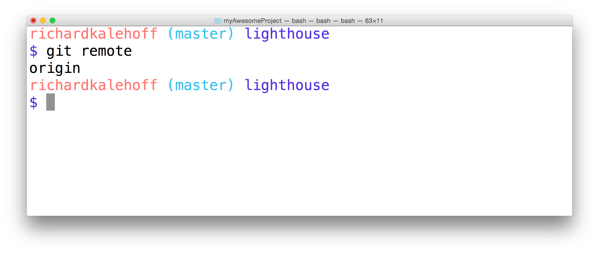
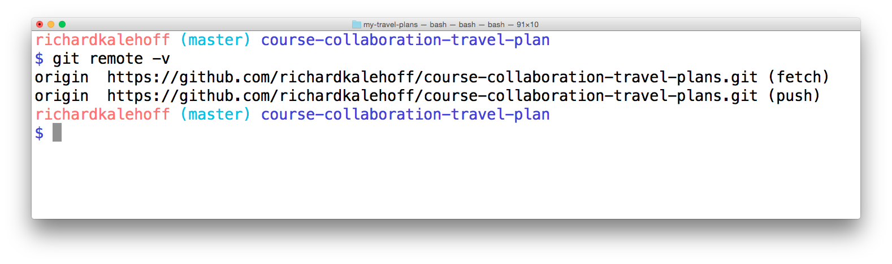
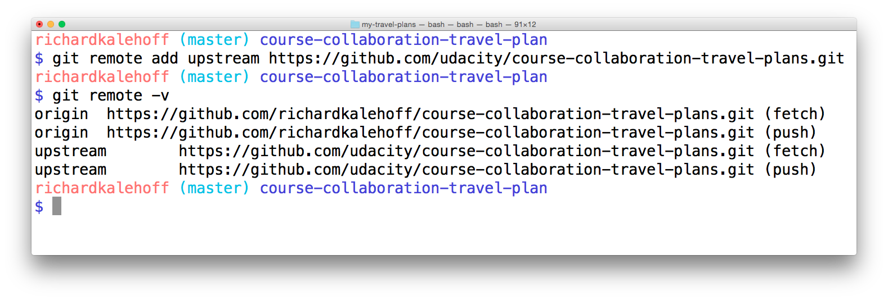

# Collaboration Setup
As a lone developer, you're probably comfortable working with a local repository. In this first lesson, we're going to talk about **remote repositories** and interacting with these remote repositories.

Let's say that you have a friend, we'll call her Farrin, and one day you two were together and you showed her what you've been working on. She had some ideas on features she could contribute to the project. But you don't want to give her your computer for her to make these changes, you want her to work on her computer. And, you don't want to have to wait for her to add these features, you want to keep working on the project and then just merge in her changes with she's finished. So how can we do that?

Well, let me tell you that emailing the project back and forth would be a maintenance nightmare after about two emails. You're already tracking your project with Git, so we'll use it to manage everything.

So Farrin will work on the project on a specific branch and any changes she makes she'll add to that branch. While she's working in her branch, you'll work on the project but on your own specific branch. And then you can merge these branches together when you get the branch from Farrin.

> 💡 ## Always Use Topic Branches
> Remember that it's incredibly helpful to make all of your commits on descriptively named topic branches.  Branches help isolate unrelated changes from each other.
> 
> So when you're collaborating with other developers make sure to create a new branch that has a descriptive name that describes what changes it contains.

## git push vs git pull
if you have changes in your local repository that you want in your remote repository, you'll ```git push```
vice versa ```git pull``` grabs the changes from remote onto your local repository.

# What is a Remote Repository?
Git is a distributed version control system which means there is not one main repository of information. Each developer has a copy of the repository. So you can have a copy of the repository (which includes the published commits and version history) and your friend can also have a copy of the same repository. Each repository has the exact same information that the other ones have, there's no one repository that's the main one.

Up until this point, you have probably been only working locally on a local repository. A remote repository is the same Git repository like yours but it exists somewhere else.


# Ways to access a Remote
Remotes can be accessed in a couple of ways:

- with a URL
- path to a file system
Even though it's possible to create a remote repository on your file system, it's very rarely used. By far the most common way to access a remote repository is through a URL to a repository that’s out on the web.

The way we can interact and control a remote repository is through the Git remote command:
```
$ git remote
```

## Branches on local to remote
We can merge local **topic branch** onto ```master``` branch and push to remote as a ```master``` branch
or we can keep track the branches separately on the remote repository as well.

## Why Multiple Remotes?
Why would you want to have multiple remote repositories? We'll look at this later but briefly, if you are working with multiple developers then you might want to get changes they're working on in their branch(es) into your project before they merge them into the master branch. You might want to do this if you want to test out their change before you decide to implement your changes.

Another example is if you have a project whose code is hosted on Github but deploys via Git to Heroku. You would have one remote for the ```master``` and one for the ```deployment```.

# The Git Remote Command
The git remote command will let you manage and interact with remote repositories.
```
$ git remote
```
Try running this command on a local repository that you haven't shared with anyone yet. What do you get?


If you haven't configured a remote repository then this command will display nothing. One caveat to this is if you have cloned a repository. If you have, then your repository will automatically have a remote because it was cloned from the repository at the URL you provided. Let's look at a repository that has been cloned.


## Remote Shortnames
The output of ```git remote``` is just the word ```origin```. Well that's weird. The word "origin", here, is referred to as a "shortname". A shortname is just a short and easy way to refer to the location of the remote repository. A shortname is local to the current repository (as in, your local repository). The word "origin" is the defacto name that's used to refer to the main remote repository. It's possible to rename this to something else, but typically it's left as "origin".

Why do we care about how easy it is to refer to a remote repositories location? Well as you'll soon find out we'll be needing the path to the remote repository in a lot of our commands. And it's a lot easier to use just a name rather than the entire path to the remote repository.

For example which one of these is easier to understand:

- Head north for about a quarter of a mile, then turn left, go straight down that road for about 5 miles, then turn right, proceed straight for about 300 feet until you past the blue mailbox, turn left down Jack Street, go 50 feet then turn left again on Owen Road, that will curve around until you hit Finn Lane. The structure that's the third one on the left
- Grandma's house
You can see that it's a lot easier to refer to a location by just a short name like Grandma's house rather than the entire way to get there from your current location 😉

If you want to see the full path to the remote repository, then all you have to do is use the ```-v``` flag:

The Terminal application running the ```git remote``` command. The output includes the shortname and the full URL that it refers to.
Here you can see that if the word ```origin``` is used, what actually is used is the path to ```https://github.com/GoogleChrome/lighthouse.git```. It also might seem a little bit odd that there are now two remotes both of them "origin" and both going to the same URL. The only difference is right at the end: the (fetch) part and the (push) part

We'll be looking at both fetch and push in upcoming sections.

## Adding a remote repo to an existing repo
```
$ git remote add origin <url to your remote repo>
```

```git remote add``` was used to create a **shortname** of ```origin``` that points to the project on GitHub. Running ```git remote -v``` displays both the shortname and the URL.

## Recap
A remote repository is a repository that's just like the one you're using but it's just stored at a different location. To manage a remote repository, use the ```git remote``` command:
```
$ git remote
```
- It's possible to have links to multiple different remote repositories.
- A shortname is the name that's used to refer to a remote repository's location. Typically the location is a URL, but it could be a file path on the same computer.
- ```git remote add``` is used to add a connection to a new remote repository.
- ```git remote -v``` is used to see the details about a connection to a remote.

# Sending Commits
To send local commits to a remote repository you need to use the ```git push``` command. You provide the remote short name and then you supply the name of the branch that contains the commits you want to push:
```
$ git push <remote-shortname> <branch>
```
My remote's shortname is ```origin``` and the commits that I want to push are on the ```master``` branch. So I'll use the following command to send my commits to the remote repository on GitHub:
```
$ git push origin master
```
Run the following command:
```
$ git log --oneline --graph --decorate --all
```
We now have a new marker in the output! This marker is ```origin/master``` and is called a **tracking branch**. A tracking branch's name includes the shortname of the remote repository as well as the name of the branch. So the tracking branch ```origin/master``` is telling us that the remote ```origin``` has a ```master``` branch that points to commit ```9b7d28f``` (and includes all of the commits before ```9b7d28f```). This is really helpful because this means we can track the information of the remote Repository right here in our local one!

One very important thing to know is that this ```origin/master``` tracking branch is not a live representation of where the branch exists on the remote repository. If a change is made to the remote repository not by us but by someone else, the ```origin/master``` tracking branch in our local repository will not move. We have to tell it to go check for any updates and then it will move. We'll look at how to do this in the next section.

## Recap
The ```git push``` command is used to send commits from a local repository to a remote repository.
```
$ git push origin master
```
The ```git push``` command takes:

- the shortname of the remote repository you want to send commits to
- the name of the branch that has the commits you want to send

# Pull changes from a remote
Let’s say that we are in a situation where there are commits on the remote repository that we do not have in our local repository. This can happen in several ways: You could be working on a team, and a co-worker has pushed new changes to the remote. Alternatively, you could be working on the same project but from different computers -- for example, say you have a work computer and a personal computer, and you contribute to the repo from both of them. If you push changes to the repo from your work computer, the local repo on your personal computer will not reflect those changes. How do we sync new changes that are on the remote into the local repository? That's exactly where we're going to be looking at now. Let's first look at how pulling in remote changes works in theory, then we'll actually do it ourselves!

I said it before but I'll say it again, the branch that appears in the local repository is actually **tracking a branch** in the remote repository (e.g. ```origin/master``` in the local repository is called a **tracking branch** because it's tracking the progress of the master branch on the remote repository that has the shortname "origin").

## Retrieve remote commits
```
$ git pull origin master
```
```git push``` will sync the remote repository with the local repository. To do with the opposite (to sync the local with the remote), we need to use ```git pull```. The format for ```git pull``` is very similar to ```git push``` - you provided the shortname for the remote repository and then the name of the branch you want to pull in the commits.

If you don't want to automatically merge the local branch with the tracking branch then you wouldn't use ```git pull``` you would use a different command called ```git fetch```. You might want to do this if there are commits on the repository that you don't have but there are also commits on the local repository that the remote one doesn't have either.

## Recap
If there are changes in a remote repository that you'd like to include in your local repository, then you want to pull in those changes. To do that with Git, you'd use the git pull command. You tell Git the shortname of the remote you want to get the changes from and then the branch that has the changes you want:
```
$ git pull origin master
```
When ```git pull``` is run, the following things happen:

- the commit(s) on the remote branch are copied to the local repository
- the local tracking branch (```origin/master```) is moved to point to the most recent commit
- the local tracking branch (```origin/master```) is merged into the local branch (```master```)
Also, changes can be manually added on GitHub (but this is not recommended, so don't do it).

# Git Fetch vs Git Pull
Git fetch is used to retrieve commits from a remote repository's branch but it does not automatically merge the local branch with the remote tracking branch after those commits have been received.

The above paragraph is a little dense so why don't you reread it one more time.

You provide the exact same information to ```git fetch``` as you do for ```git pull```. So you provide the shortname of the remote repository you want to fetch from and then the branch you want to fetch:
```
$ git fetch origin master
```
**Note:** When we add remote, we're really creating a new remote/branch (e.g ```origin/master```) tracking the branch.
So when we do git fetch, it pulls the commit for the remote tracking branch e.g ```origing/master``` but not for the ```master``` branch itself.

When ```git fetch``` is run, the following things happen:

- the commit(s) on the remote branch are copied to the local repository
- the local tracking branch (e.g. ```origin/master```) is moved to point to the most recent commit
The important thing to note is that the local branch does not change at all.

You can think of ```git fetch``` as half of a ```git pull```. The other half of ```git pull``` is the merging aspect.

One main point when you want to use ```git fetch``` rather than ```git pull``` is if your remote branch and your local branch both have changes that neither of the other ones has. In this case, you want to fetch the remote changes to get them in your local branch and then perform a merge manually. Then you can push that new merge commit back to the remote.

## Recap
You can think of the ```git pull``` command as doing two things:

- fetching remote changes (which adds the commits to the local repository and moves the tracking branch to point to them)
- merging the local branch with the tracking branch
The ```git fetch``` command is just the first step. It just retrieves the commits and moves the tracking branch. It does not merge the local branch with the **tracking branch**. The same information provided to ```git pull``` is passed to ```git fetch```:

- the shorname of the remote repository
- the branch with commits to retrieve
```
$ git fetch origin master
```

# Git Fork
Forking is a service provided by git hosting sites to let you to copy another developer's repository and do modification on it as if its your own. When we fork a repository, we're just copying the original repository and saving it under our account. The hosting site automatically keeps a reference to the original repo.

# Pull Request
A **pull request** is a request to the original or source repository's maintainer to include changes in their project that you made in your fork of their project. You are requesting that they pull in changes you've made.

A pull request is a request for the source repository to pull in your commits and merge them with their project. To create a pull request, a couple of things need to happen:

- you must fork the source repository
- clone your fork down to your machine
- make some commits (ideally on a topic branch!)
- push the commits back to your fork
- create a new pull request and choose the branch that has your new commits

While you're working on a topic branch of changes that you want to make to a repository, that repository will probably be receiving updates of its own from the original authors.

## Stars & Watching
If you want to keep up-to-date with the Repository, GitHub offers a convenient way to keep track of repositories - it lets you star repositories:

You can go to [https://github.com/stars](https://github.com/stars) to list out and filter all of the repositories that you have starred.

Starring is helpful if you want to keep track of certain repositories. But it's not entirely helpful if you need to actively keep up with a repositories development because you have to manually go to the stars page to view the repositories and see if they've changed.

## Watching A Repository
If you need to keep up with a project's changes and want to be notified of when things change, GitHub offers a "Watch" feature:

If you're working on a repository quite often, then I'd suggest setting the watch setting to "Watching". This way GitHub will notify you whenever anything happens with the repository like people pushing changes to the repository, new issues being created, or comments being added to existing issues.

## Including Upstream Changes
Now that you know about watching your repository let say that you're watching it and you get notified that some commits have been pushed to the original, source repository. How do you go about getting those changes into your fork of the repository? If you want to keep doing development on your fork then you'd need your fork to stay in sync with the source repository as much as possible.

Let's see how we can get these changes from the remote repository into our repository.

Incase Lam starts making changes to her project that I won't have in my fork of her project, I'll add her project as an additional remote so that I can stay in sync with her.

In my local repository, I already have one remote repository which is ```origin``` remote.



Remember that the word ```origin``` is just the default name that's used when you ```git clone``` a remote repository for the first time. We're going to use the git remote command to add a new **shortname** and URL to this list. This will give us a connection to the source repository.
```
$ git remote add upstream https://github.com/udacity/course-collaboration-travel-plans.git
```
Notice that I've used the name ```upstream``` as the shortname to reference the source repository. As with the ```origin``` shortname, the word ```upstream``` here is not special in any way; It's just a regular word. This could have been any word... like the word "banana". But the word "upstream" is typically used to refer to the source repository.

Let's check out what the list of remotes looks like now after adding this new remote:



## Origin vs Upstream Clarification
One thing that can be a tiny bit confusing right now is the difference between the ```origin``` and ```upstream```. What might be confusing is that origin does not refer to the source repository (also known as the "original" repository) that we forked from. Instead, it's pointing to our forked repository. So even though it has the word ```origin``` is not actually the original repository.

Remember that the names ```origin``` and ```upstream``` are just the default or de facto names that are used. If it's clearer for you to name your ```origin``` remote ```mine``` and the ```upstream``` remote ```source-repo```, then by all means, go ahead and rename them. What you name your remote repositories in your local repository does not affect the source repository at all.

> ## ⚠️ Resetting Remote Names ⚠️
> The image above demos the renaming of the remotes, but I have returned them to their default/defacto names of origin and upstream with the following commands:
> ```
> $ git remote rename mine origin
> $ git remote rename source-repo upstream
> ```

## Pulling Upstream Changes
Now to get the changes from ```upstream``` remote repository, all we have to do is run a ```git pull``` and use the ```upstream``` shortname rather than the ```origin``` shortname:
```
$ git pull upstream master
```

To get all upstream commits without automatically merging
```
# get all upstream commits onto upstream/master
$ git fetch upstream master

# to make sure I'm on the correct branch for merging
$ git checkout master

# merge in Lam's changes
$ git merge upstream/master

# send Lam's changes to *my* remote
$ git push origin master
```
## Recap
When working with a project that you've forked. The original project's maintainer will continue adding changes to their project. You'll want to keep your fork of their project in sync with theirs so that you can include any changes they make.

To get commits from a source repository into your forked repository on GitHub you need to:

- get the cloneable URL of the source repository
- create a new remote with the git remote add command
   - use the shortname upstream to point to the source repository
   - provide the URL of the source repository
- fetch the new upstream remote
- merge the upstream's branch into a local branch
- push the newly updated local branch to your origin repo

# Squashing commits for pull request

To squash commits together, we're going to use the extremely powerful ```git rebase``` command. This is one of my favorite commands, but it did take me quite a while to become comfortable with it. At first, it was somewhat challenging for me to get a handle on how it works, and then (after reading countless warnings online) I was scared to actually use it for fear of irreparably damaging my project's Git history.

But I'm here to tell you that ```git rebase``` isn't really all that difficult, and that you can bravely make changes to your repository without fear of doing any damage! (<-- quite the claim, isn't it!?!)

Let's first get a big picture idea of how squashing works, and then we'll actually do some squashing with the ```git rebase``` command.

[](https://youtu.be/H5JqcdIB5y0)
```
$ git rebase -i HEAD~3
```

Say we have the last few commits as minor and related commits for a bigger feature. ```HEAD``` is a pointer to the current position in the repo, we can first create a backup branch 
```
$ git branch backup
```
This will have all of our commits
If we want to group the last 3 commits together, while we're still on master branch
```
$ git rebase -i HEAD~3
```
This squashes the last 3 commit into 1 and create a new sha/commit and point move ```master``` to it.

The ```-i``` in the command stands for "interactive". You can perform a rebase in a non-interactive mode. While you're learning how to rebase, though, I definitely recommend that you do interactive rebasing.
[](https://youtu.be/cL6ehKtJLUM)

After rebasing, our local commit will be different than remote commits history. Therefore if we try to do a simple push, git will reject it.

We'll need to use the force flag
```
$ git push -f origin master
```

## Rebase Commands
Let's take another look at the different commands that you can do with ```git rebase```:

- use p or pick – to keep the commit as is
- use r or reword – to keep the commit's content but alter the commit message
- use e or edit – to keep the commit's content but stop before committing so that you can:
  - add new content or files
  - remove content or files
  - alter the content that was going to be committed
- use s or squash – to combine this commit's changes into the previous commit (the commit above it in the list)
- use f or fixup – to combine this commit's change into the previous one but drop the commit message
- use x or exec – to run a shell command
- use d or drop – to delete the commit

## When to rebase
As you've seen, the ```git rebase``` command is incredibly powerful. It can help you edit commit messages, reorder commits, combine commits, etc. So it truly is a powerhouse of a tool. Now the question becomes "When should you rebase?".

Whenever you rebase commits, Git will create a new SHA for each commit! This has drastic implications. To Git, the SHA is the identifier for a commit, so a different identifier means it's a different commit, regardless if the content has changed at all.

So you should not rebase if you have already pushed the commits you want to rebase. If you're collaborating with other developers, then they might already be working with the commits you've pushed. If you then use ```git rebase``` to change things around and then force push the commits, then the other developers will now be out of sync with the remote repository. They will have to do some complicated surgery to their Git repository to get their repo back in a working state...and it might not even be possible for them to do that; they might just have to scrap all of their work and start over with your newly-rebased, force-pushed commits.

## Recap
The git rebase command is used to do a great many things.
```
# interactive rebase
$ git rebase -i <base>

# interactively rebase the commits to the one that's 3 before the one we're on
$ git rebase -i HEAD~3
```
Inside the interactive list of commits, all commits start out as ```pick```, but you can swap that out with one of the other commands (```reword```, ```edit```, ```squash```, ```fixup```, ```exec```, and ```drop```).

I recommend that you create a ```backup``` branch before rebasing, so that it's easy to return to your previous state. If you're happy with the rebase, then you can just delete the ```backup``` branch!