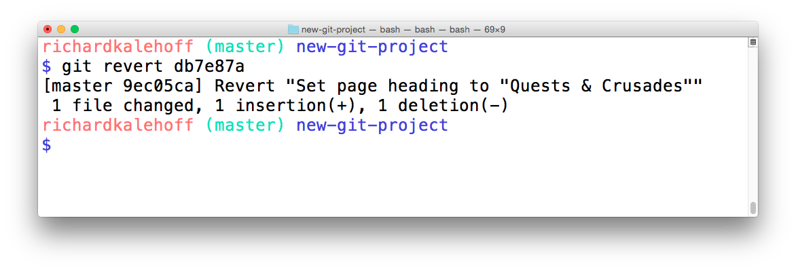

# What Is A Revert?
When you tell Git to **revert** a specific commit, Git takes the changes that were made in commit and does the exact opposite of them. Let's break that down a bit. If a character is added in commit A, if Git reverts commit A, then Git will make a new commit where that character is deleted. It also works the other way where if a character/line is removed, then reverting that commit will add that content back!

We ended the previous lesson with a merge conflict and resolved that conflict by setting the heading to ```Adventurous Quest```. Let's say that there's a commit in your repository that changes the heading now to ```Quests & Crusades```.

# The ```git revert``` Command
Now that I've made a commit with some changes, I can revert it with the ```git revert``` command

```$ git revert <SHA-of-commit-to-revert>```
Since the SHA of the most-recent commit is ```db7e87a```, to revert it: I'll just run ```git revert db7e87a``` (this will pop open my code editor to edit/accept the provided commit message)

I'll get the following output:
